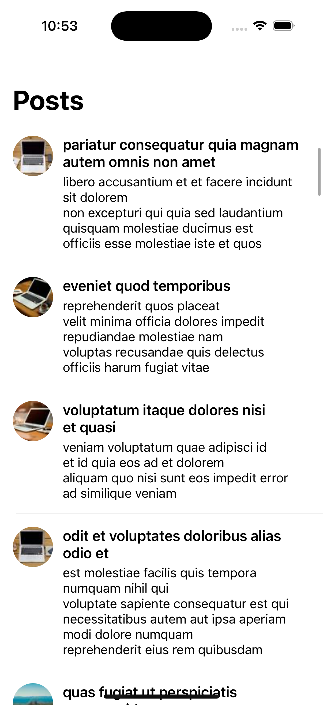

# JSONTestTask

Простое iOS-приложение, написанное на **UIKit** без использования Storyboard по ТЗ как тестовое задание.

## Описание

Приложение загружает список постов с сервиса [JSONPlaceholder](https://jsonplaceholder.typicode.com/) и отображает их в таблице. Также отображаются аватары пользователей.  
Данные сохраняются локально в **Core Data**, чтобы при отсутствии интернета можно было просмотреть уже загруженные посты.

Реализовано:
- Загрузка постов с JSONPlaceholder
- Загрузка аватарок через `URLSession`
- Кэширование данных через Core Data
- Pull to Refresh (обновление ленты при прокрутке вверх)
- Пагинация (подгрузка при скролле вниз)
- Использован `GCD` для обновления UI
- Минимальный UI на UIKit без storyboard

## Технологии

- UIKit
- Alamofire
- URLSession
- Core Data
- GCD
- Auto Layout (программно, без storyboard)

## Архитектура MVVM

В приложении используется паттерн **MVVM (Model-View-ViewModel)** для разделения ответственности и упрощения поддержки кода.

- **Model** — `Post`, который содержит свойства поста (заголовок, тело, id и т.д.).

- **ViewModel** —`PostViewModel` содержит логику форматирования текста, загрузки аватарок, а также управление состояниями (загрузка, ошибки).

- **View** .

## Скриншоты



## Установка

1. Склонируйте репозиторий:
   ```bash
   git clone https://github.com/IvankovDaniil/jsontesttask.git
   cd jsontesttask
   open JSONTestTask.xcodeproj
   ``` 
   
